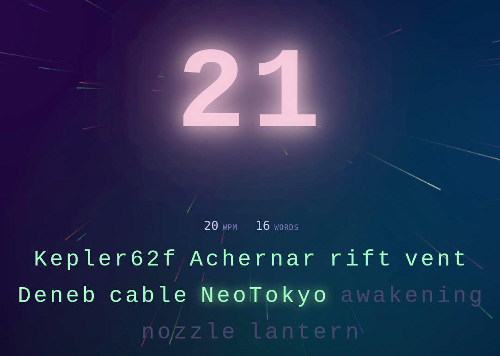

# GALACTYL 3000

> ⚠️ Warning: this game contains flashing lights.

**Play:** https://solargc.github.io/galactyl-3000/



A typing game where every keystroke propels you through space. Type faster to accelerate — let your speed decay into the void.

Desktop only. Fullscreen supported.

## How to play

Press **Space** or **Enter** to start. You have 100 seconds.

Type the displayed words and hit **Space** to submit each one. Press **Enter** to get a new set of words. The game pauses if the window loses focus.

## Stack

TypeScript · React · CSS · Vite

## Notes

Built mostly with [Claude](https://claude.ai). The goal was to play with modern CSS and automated workflows.

## Run locally

```bash
npm install
npm run dev
```
